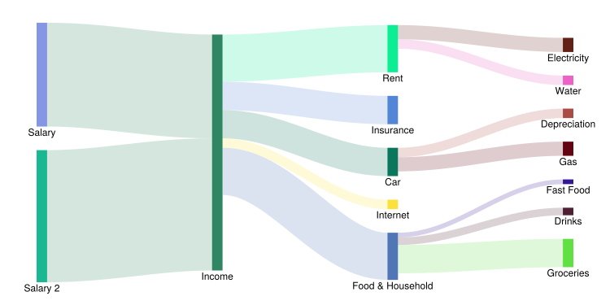
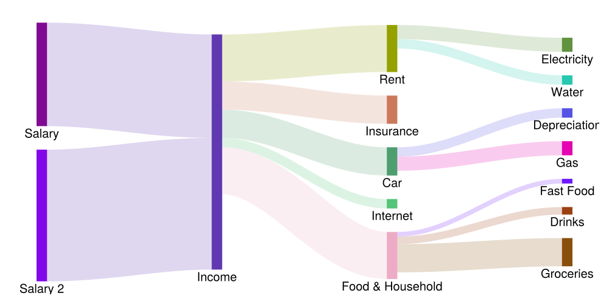

A Makie port of [https://github.com/daschw/SankeyPlots.jl](https://github.com/daschw/SankeyPlots.jl)

## Example

```julia
using SankeyMakie
using CairoMakie
using Random
Random.seed!(123)

connections = [
    (1, 2, 1100),
    (2, 4, 300),
    (6, 2, 1400),
    (2, 3, 500),
    (2, 5, 300),
    (5, 7, 100),
    (2, 8, 100),
    (3, 9, 150),
    (2, 10, 500),
    (10, 11, 50),
    (10, 12, 80),
    (5, 13, 150),
    (3, 14, 100),
    (10, 15, 300),
]

labels = [
    "Salary",
    "Income",
    "Rent",
    "Insurance",
    "Car",
    "Salary 2",
    "Depreciation",
    "Internet",
    "Electricity",
    "Food & Household",
    "Fast Food",
    "Drinks",
    "Gas",
    "Water",
    "Groceries",
]

fig, ax, plt = sankey(
    connections,
    nodelabels = labels,
    nodecolor = rand(RGBf, length(labels)),
    linkcolor = SankeyMakie.TargetColor(0.2),
    fontsize = 20,
    forceorder = [6 => 1], # Salary 2 before Salary
    figure = (; size = (1000, 500)),
)

hidedecorations!(ax)
hidespines!(ax)

save("sankey.svg", fig)

fig
```



It is also possible to reverse the order of all nodes within each layer by specifying `forceorder = :reverse`.

```julia
fig, ax, plt = sankey(
    connections,
    nodelabels = labels,
    nodecolor = rand(RGBf, length(labels)),
    linkcolor = SankeyMakie.TargetColor(0.2),
    fontsize = 20,
    forceorder = :reverse,
    figure = (; size = (1000, 500)),
)

hidedecorations!(ax)
hidespines!(ax)

save("sankey_reverse.svg", fig)
```


